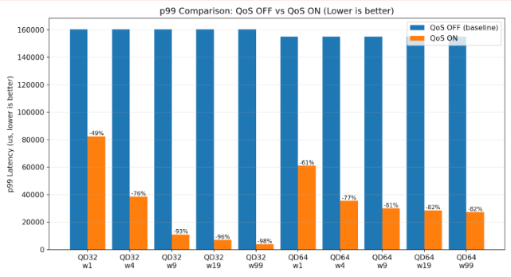

# NVMe QoS for Linux

A lightweight, per-queue Quality of Service IO Scheduler for cloud environments and multi-tenant systems running Linux.
The latency-sensitive applications on these systems suffer degraded performance (99th percentile latencies increasing by upwards of 500%) when competing with throughput-intensive workloads, such as backups, batch processing, and archiving.

A machine using this scheduler will be able to manually fine-tune the ratio of IO requests between latency-sensitive and through-put intensive applications, as well as dynamically turn on and off the scheduler depending on the system's needs.
Additionally, the CPU usage will only increase by around 10-15% on average.
As a drawback, however, there will be notably degraded performance for the throughput-intensive applications and workloads as they give up their IO slots.

*1. Proof of Above Claims*

For more information on this project's intent, development, and future goals, please read the research paper [here](https://.example.com). **DOI: `tba`**

See [`CONTRIBUTING.md`](./CONTRIBUTING.md) for setup, build instructions, and
contribution guidelines.

## Maintainers

@BrandonPacewic, @phannawich, @TSrirama2026, @Benjamin-Anderson-II, @CameronDilworth

**Project Partner:** @godhanipayal

## Issues and Feature Requests
When encountering an issue or requesting a feature please make a post in the discussion tab of this repository.

## License
This project is licensed under GPL-2.0 with the Linux-syscall-note exception,
the same license as the Linux kernel. See [`COPYING`](./COPYING) for details.
All contributions are subject to this license.
